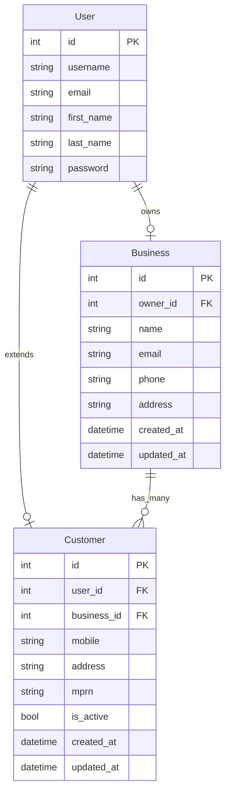
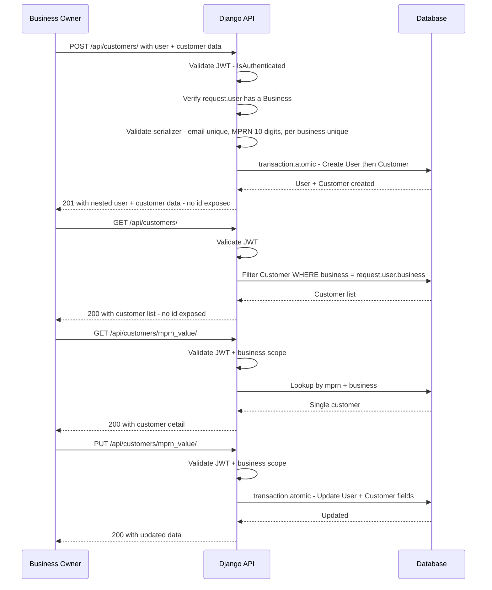
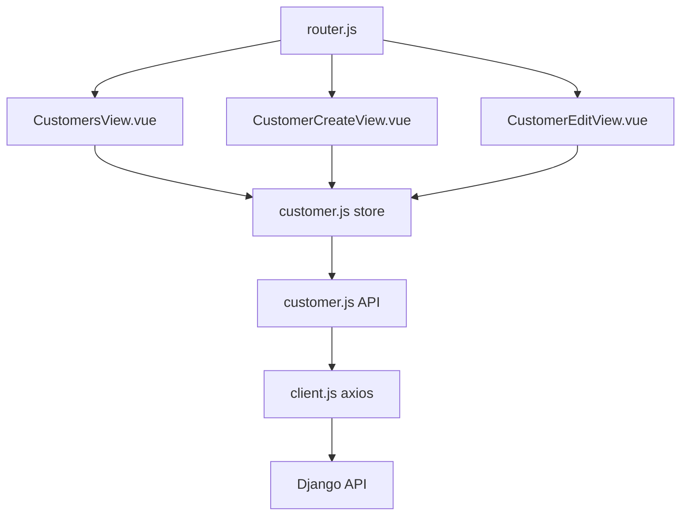
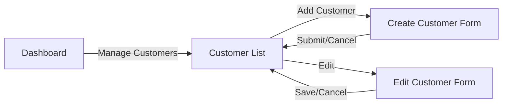

# Customer Model Plan

## Overview

Add a `Customer` model to the existing `trading` app that extends Django's `User` model via a `OneToOneField`. Customers belong to a `Business` (multi-tenancy via ForeignKey). Business owners can create, list, retrieve, and update customers — but never delete them (soft-deactivation only via `is_active`).

**Key constraints:**
- `mprn` and `mobile` are unique **per-business**, not globally
- The `id` (primary key) is **never exposed** in API responses
- `mprn` is used as the URL lookup field for customer detail/update endpoints

---

## Architecture Diagram



**Constraints on Customer:**
- `UniqueConstraint` on `business` + `mprn` — MPRN unique per business
- `UniqueConstraint` on `business` + `mobile` — Mobile unique per business

---

## API Flow



---

## Part 1: Backend File Changes

### 1. `powerdealer/trading/models.py` — Add Customer Model

Append the `Customer` model after the existing `Business` model. Do NOT modify the existing `Business` model.

```python
from django.core.validators import RegexValidator


class Customer(models.Model):
    """Customer profile extending User, scoped to a Business"""
    user = models.OneToOneField(User, on_delete=models.CASCADE, related_name='customer')
    business = models.ForeignKey(Business, on_delete=models.CASCADE, related_name='customers')
    mobile = models.CharField(max_length=20)
    address = models.TextField(blank=True)
    mprn = models.CharField(
        max_length=10,
        verbose_name='MPRN',
        validators=[RegexValidator(r'^\d{10}$', 'MPRN must be exactly 10 digits.')],
    )
    is_active = models.BooleanField(default=True)
    created_at = models.DateTimeField(auto_now_add=True)
    updated_at = models.DateTimeField(auto_now=True)

    class Meta:
        ordering = ['-created_at']
        constraints = [
            models.UniqueConstraint(
                fields=['business', 'mprn'],
                name='unique_mprn_per_business',
            ),
            models.UniqueConstraint(
                fields=['business', 'mobile'],
                name='unique_mobile_per_business',
            ),
        ]

    def __str__(self):
        return f"{self.user.get_full_name()} - {self.mprn}"
```

**Key decisions:**
- `user` — `OneToOneField` to `User` with `related_name='customer'` so `user.customer` works
- `business` — `ForeignKey` to `Business` with `related_name='customers'` so `business.customers.all()` works
- `mobile` — **no global `unique=True`**; uniqueness enforced per-business via `UniqueConstraint`
- `mprn` — **no global `unique=True`**; uniqueness enforced per-business via `UniqueConstraint`; model-level `RegexValidator` ensures exactly 10 digits
- `is_active` — defaults to `True`, used for soft-delete
- `on_delete=models.CASCADE` on both FKs — if User or Business is deleted, Customer is removed
- Uses `models.UniqueConstraint` (modern Django approach, preferred over deprecated `unique_together`)

---

### 2. `powerdealer/trading/admin.py` — Register Customer Admin

Append `CustomerAdmin` registration. Do NOT modify existing `BusinessAdmin`.

```python
from .models import Business, Customer

@admin.register(Customer)
class CustomerAdmin(admin.ModelAdmin):
    list_display = ['user', 'business', 'mobile', 'mprn', 'is_active', 'created_at']
    list_filter = ['is_active', 'business']
    search_fields = ['user__username', 'user__email', 'user__first_name', 'user__last_name', 'mobile', 'mprn']
    readonly_fields = ['created_at', 'updated_at']
    fieldsets = (
        ('User', {'fields': ('user', 'business')}),
        ('Customer Info', {'fields': ('mobile', 'address', 'mprn')}),
        ('Status', {'fields': ('is_active',)}),
        ('Timestamps', {'fields': ('created_at', 'updated_at')}),
    )
```

---

### 3. `powerdealer/trading/serializers.py` — Add Customer Serializers

Append two serializers. **Critical: `id` is excluded from all serializer `fields` lists.**

**`CustomerSerializer`** — For read/list/detail responses and updates:
- Nested `UserSerializer` for `user` field (read-only on output)
- On update: accepts `first_name`, `last_name`, `email` at top level to update the related User
- Validates MPRN is exactly 10 numeric digits
- Validates per-business uniqueness for MPRN and mobile in serializer
- Supports partial updates to both User and Customer fields
- **`id` is NOT in `fields`** — never exposed to frontend

**`CustomerCreateSerializer`** — For creating a new customer:
- Accepts `first_name`, `last_name`, `email`, `password`, `mobile`, `address`, `mprn`
- Validates email uniqueness at User level
- Validates MPRN is exactly 10 numeric digits
- Validates per-business uniqueness for MPRN and mobile
- Creates User + Customer atomically in `create()` method
- Uses email as username
- **Returns data via `CustomerSerializer`** which excludes `id`

```python
class CustomerSerializer(serializers.ModelSerializer):
    """Serializer for Customer read/update operations. id is never exposed."""
    user = UserSerializer(read_only=True)
    first_name = serializers.CharField(write_only=True, required=False)
    last_name = serializers.CharField(write_only=True, required=False)
    email = serializers.EmailField(write_only=True, required=False)

    class Meta:
        model = Customer
        fields = ['user', 'mobile', 'address', 'mprn', 'is_active',
                  'first_name', 'last_name', 'email', 'created_at', 'updated_at']
        read_only_fields = ['business', 'created_at', 'updated_at']

    def validate_mprn(self, value):
        if not value.isdigit() or len(value) != 10:
            raise serializers.ValidationError("MPRN must be exactly 10 digits.")
        business = self.instance.business if self.instance else self.context.get('business')
        if business:
            qs = Customer.objects.filter(business=business, mprn=value)
            if self.instance:
                qs = qs.exclude(pk=self.instance.pk)
            if qs.exists():
                raise serializers.ValidationError("This MPRN is already registered in your business.")
        return value

    def validate_mobile(self, value):
        business = self.instance.business if self.instance else self.context.get('business')
        if business:
            qs = Customer.objects.filter(business=business, mobile=value)
            if self.instance:
                qs = qs.exclude(pk=self.instance.pk)
            if qs.exists():
                raise serializers.ValidationError("This mobile number is already registered in your business.")
        return value

    def validate_email(self, value):
        if value:
            qs = User.objects.filter(email=value)
            if self.instance:
                qs = qs.exclude(pk=self.instance.user.pk)
            if qs.exists():
                raise serializers.ValidationError("This email is already registered.")
        return value

    def update(self, instance, validated_data):
        first_name = validated_data.pop('first_name', None)
        last_name = validated_data.pop('last_name', None)
        email = validated_data.pop('email', None)

        user = instance.user
        if first_name is not None:
            user.first_name = first_name
        if last_name is not None:
            user.last_name = last_name
        if email is not None:
            user.email = email
        user.save()

        return super().update(instance, validated_data)


class CustomerCreateSerializer(serializers.Serializer):
    """Serializer for creating a new Customer + User atomically."""
    first_name = serializers.CharField(max_length=150)
    last_name = serializers.CharField(max_length=150)
    email = serializers.EmailField()
    password = serializers.CharField(write_only=True, min_length=6)
    mobile = serializers.CharField(max_length=20)
    address = serializers.CharField(required=False, allow_blank=True)
    mprn = serializers.CharField(max_length=10)

    def validate_email(self, value):
        if User.objects.filter(email=value).exists():
            raise serializers.ValidationError("This email is already registered.")
        return value

    def validate_mobile(self, value):
        business = self.context.get('business')
        if business and Customer.objects.filter(business=business, mobile=value).exists():
            raise serializers.ValidationError("This mobile number is already registered in your business.")
        return value

    def validate_mprn(self, value):
        if not value.isdigit() or len(value) != 10:
            raise serializers.ValidationError("MPRN must be exactly 10 digits.")
        business = self.context.get('business')
        if business and Customer.objects.filter(business=business, mprn=value).exists():
            raise serializers.ValidationError("This MPRN is already registered in your business.")
        return value

    def create(self, validated_data):
        from django.db import transaction

        business = self.context['business']

        with transaction.atomic():
            user = User.objects.create_user(
                username=validated_data['email'],
                email=validated_data['email'],
                password=validated_data['password'],
                first_name=validated_data['first_name'],
                last_name=validated_data['last_name'],
            )
            customer = Customer.objects.create(
                user=user,
                business=business,
                mobile=validated_data['mobile'],
                address=validated_data.get('address', ''),
                mprn=validated_data['mprn'],
            )
        return customer
```

---

### 4. `powerdealer/trading/views.py` — Add Customer Views

Append two views following the existing `APIView` pattern. **URL lookup uses `mprn` instead of `pk`.**

```python
from .models import Business, Customer
from .serializers import (
    SignupSerializer, LoginSerializer, BusinessSerializer,
    CustomerSerializer, CustomerCreateSerializer,
)


class CustomerListCreateView(APIView):
    """List and create customers for the authenticated business owner."""

    def get(self, request):
        if not request.user.is_authenticated:
            return Response({'success': False, 'message': 'Login required.', 'errors': {}},
                            status=status.HTTP_401_UNAUTHORIZED)
        try:
            business = request.user.business
        except Business.DoesNotExist:
            return Response({'success': False, 'message': 'Business not found.', 'errors': {}},
                            status=status.HTTP_404_NOT_FOUND)

        customers = Customer.objects.filter(business=business).select_related('user')
        serializer = CustomerSerializer(customers, many=True)
        return Response({
            'success': True,
            'message': 'Customers retrieved successfully.',
            'data': serializer.data,
        })

    def post(self, request):
        if not request.user.is_authenticated:
            return Response({'success': False, 'message': 'Login required.', 'errors': {}},
                            status=status.HTTP_401_UNAUTHORIZED)
        try:
            business = request.user.business
        except Business.DoesNotExist:
            return Response({'success': False, 'message': 'Business not found.', 'errors': {}},
                            status=status.HTTP_404_NOT_FOUND)

        serializer = CustomerCreateSerializer(data=request.data, context={'business': business})
        if serializer.is_valid():
            customer = serializer.save()
            logger.info(f"Customer created: {customer.user.email} for business {business.name}")
            return Response({
                'success': True,
                'message': 'Customer created successfully.',
                'data': CustomerSerializer(customer).data,
            }, status=status.HTTP_201_CREATED)

        return Response({
            'success': False,
            'message': 'Please check your input.',
            'errors': serializer.errors,
        }, status=status.HTTP_400_BAD_REQUEST)


class CustomerDetailView(APIView):
    """Retrieve and update a single customer by MPRN, scoped to business."""

    def _get_customer(self, request, mprn):
        if not request.user.is_authenticated:
            return None, Response({'success': False, 'message': 'Login required.', 'errors': {}},
                                  status=status.HTTP_401_UNAUTHORIZED)
        try:
            business = request.user.business
        except Business.DoesNotExist:
            return None, Response({'success': False, 'message': 'Business not found.', 'errors': {}},
                                  status=status.HTTP_404_NOT_FOUND)
        try:
            customer = Customer.objects.select_related('user').get(mprn=mprn, business=business)
        except Customer.DoesNotExist:
            return None, Response({'success': False, 'message': 'Customer not found.', 'errors': {}},
                                  status=status.HTTP_404_NOT_FOUND)
        return customer, None

    def get(self, request, mprn):
        customer, error_response = self._get_customer(request, mprn)
        if error_response:
            return error_response
        return Response({
            'success': True,
            'message': 'Customer retrieved successfully.',
            'data': CustomerSerializer(customer).data,
        })

    def put(self, request, mprn):
        customer, error_response = self._get_customer(request, mprn)
        if error_response:
            return error_response
        serializer = CustomerSerializer(customer, data=request.data, partial=True)
        if serializer.is_valid():
            serializer.save()
            logger.info(f"Customer updated: {customer.user.email}")
            return Response({
                'success': True,
                'message': 'Customer updated successfully.',
                'data': serializer.data,
            })
        return Response({
            'success': False,
            'message': 'Please check your input.',
            'errors': serializer.errors,
        }, status=status.HTTP_400_BAD_REQUEST)

    def patch(self, request, mprn):
        return self.put(request, mprn)
```

---

### 5. `powerdealer/trading/urls.py` — Register Customer Endpoints

Replace the full file with updated imports and appended customer URL patterns:

```python
from django.urls import path
from .views import (
    SignupView, LoginView, BusinessDetailView, MeView, HealthCheckView,
    CustomerListCreateView, CustomerDetailView,
)

urlpatterns = [
    path('health/', HealthCheckView.as_view(), name='health'),
    path('auth/signup/', SignupView.as_view(), name='signup'),
    path('auth/login/', LoginView.as_view(), name='login'),
    path('auth/me/', MeView.as_view(), name='me'),
    path('business/', BusinessDetailView.as_view(), name='business'),
    path('customers/', CustomerListCreateView.as_view(), name='customer-list-create'),
    path('customers/<str:mprn>/', CustomerDetailView.as_view(), name='customer-detail'),
]
```

This results in:
- `POST /api/customers/` — Create customer
- `GET /api/customers/` — List customers
- `GET /api/customers/<mprn>/` — Retrieve customer by MPRN
- `PUT/PATCH /api/customers/<mprn>/` — Update customer by MPRN

---

### 6. Migration

Run `python manage.py makemigrations trading` to generate the migration file for the new `Customer` model.

---

## Part 2: Frontend File Changes

### Frontend Architecture



**Patterns followed from existing codebase:**
- API layer: thin wrapper functions in `src/api/customer.js` (same pattern as [`auth.js`](powerdealer_f/src/api/auth.js))
- Store: Pinia composition API store in `src/stores/customer.js` (same pattern as [`business.js`](powerdealer_f/src/stores/business.js))
- Views: Vue 3 `<script setup>` with scoped CSS (same pattern as [`DashboardView.vue`](powerdealer_f/src/views/DashboardView.vue))
- Styling: plain CSS, no framework — consistent with existing views

---

### 7. `powerdealer_f/src/api/customer.js` — Customer API Module

New file. Thin wrapper around the axios client for customer endpoints.

```javascript
import api from './client'

export const customerApi = {
  list() {
    return api.get('/customers/')
  },

  get(mprn) {
    return api.get(`/customers/${mprn}/`)
  },

  create(data) {
    return api.post('/customers/', data)
  },

  update(mprn, data) {
    return api.put(`/customers/${mprn}/`, data)
  },
}
```

---

### 8. `powerdealer_f/src/stores/customer.js` — Customer Pinia Store

New file. Manages customer list, single customer, loading, and error state.

```javascript
import { defineStore } from 'pinia'
import { ref } from 'vue'
import { customerApi } from '../api/customer'
import { getErrorMessage } from '../api/client'

export const useCustomerStore = defineStore('customer', () => {
  const customers = ref([])
  const customer = ref(null)
  const loading = ref(false)
  const error = ref(null)

  const fetchCustomers = async () => {
    loading.value = true
    error.value = null
    try {
      const response = await customerApi.list()
      customers.value = response.data.data
      return response.data
    } catch (err) {
      error.value = getErrorMessage(err)
      throw err
    } finally {
      loading.value = false
    }
  }

  const fetchCustomer = async (mprn) => {
    loading.value = true
    error.value = null
    try {
      const response = await customerApi.get(mprn)
      customer.value = response.data.data
      return response.data
    } catch (err) {
      error.value = getErrorMessage(err)
      throw err
    } finally {
      loading.value = false
    }
  }

  const createCustomer = async (data) => {
    loading.value = true
    error.value = null
    try {
      const response = await customerApi.create(data)
      return response.data
    } catch (err) {
      error.value = getErrorMessage(err)
      throw err
    } finally {
      loading.value = false
    }
  }

  const updateCustomer = async (mprn, data) => {
    loading.value = true
    error.value = null
    try {
      const response = await customerApi.update(mprn, data)
      customer.value = response.data.data
      return response.data
    } catch (err) {
      error.value = getErrorMessage(err)
      throw err
    } finally {
      loading.value = false
    }
  }

  return {
    customers,
    customer,
    loading,
    error,
    fetchCustomers,
    fetchCustomer,
    createCustomer,
    updateCustomer,
  }
})
```

---

### 9. `powerdealer_f/src/views/CustomersView.vue` — Customer List Page

New file. Displays a table of all customers with:
- Search/filter by name, email, MPRN, or mobile
- "Add Customer" button linking to create form
- Each row has an "Edit" link to the edit form
- Status badge showing Active/Inactive
- Toggle active/inactive status inline

**Key UI elements:**
- Header with title + "Add Customer" button
- Search input for filtering
- Table with columns: Name, Email, Mobile, MPRN, Status, Actions
- Loading state
- Empty state when no customers exist

---

### 10. `powerdealer_f/src/views/CustomerCreateView.vue` — Create Customer Form

New file. Form with fields:
- First Name, Last Name, Email, Password, Mobile, Address, MPRN
- Validation messages displayed per-field from backend errors
- Submit button with loading state
- Cancel button to go back to customer list
- On success: redirect to customer list with success message

---

### 11. `powerdealer_f/src/views/CustomerEditView.vue` — Edit Customer Form

New file. Pre-populated form loaded by MPRN from route params:
- First Name, Last Name, Email (from nested user), Mobile, Address, MPRN, Is Active toggle
- Partial update support — only changed fields sent
- Validation messages displayed per-field
- Save button with loading state
- Cancel button to go back to customer list
- On success: redirect to customer list

---

### 12. `powerdealer_f/src/router.js` — Add Customer Routes

Append three new routes (all require auth):

```javascript
import CustomersView from './views/CustomersView.vue'
import CustomerCreateView from './views/CustomerCreateView.vue'
import CustomerEditView from './views/CustomerEditView.vue'

// Add to routes array:
{
  path: '/customers',
  component: CustomersView,
  meta: { title: 'Customers', requiresAuth: true },
},
{
  path: '/customers/create',
  component: CustomerCreateView,
  meta: { title: 'Add Customer', requiresAuth: true },
},
{
  path: '/customers/:mprn/edit',
  component: CustomerEditView,
  meta: { title: 'Edit Customer', requiresAuth: true },
},
```

---

### 13. `powerdealer_f/src/views/DashboardView.vue` — Add Navigation Link

Add a "Manage Customers" button/link in the dashboard content area that navigates to `/customers`.

---

## Frontend Navigation Flow



---

## Response Format Consistency

All responses follow the existing pattern:

```json
{
    "success": true,
    "message": "Human-readable message",
    "data": { ... }
}
```

Error responses:

```json
{
    "success": false,
    "message": "Human-readable error message",
    "errors": { ... }
}
```

**Example customer list response (note: no `id` field):**

```json
{
    "success": true,
    "message": "Customers retrieved successfully.",
    "data": [
        {
            "user": {
                "id": 5,
                "username": "john@example.com",
                "email": "john@example.com",
                "first_name": "John",
                "last_name": "Doe"
            },
            "mobile": "0851234567",
            "address": "123 Main St, Dublin",
            "mprn": "1234567890",
            "is_active": true,
            "created_at": "2026-02-22T16:00:00Z",
            "updated_at": "2026-02-22T16:00:00Z"
        }
    ]
}
```

---

## Security Summary

| Concern | Implementation |
|---------|---------------|
| Authentication | JWT via `request.user.is_authenticated` check |
| Multi-tenancy | All queries filtered by `business=request.user.business` |
| Ownership | Only business owners can create/update customers |
| Soft delete | `is_active=False` instead of hard delete |
| MPRN validation | Exactly 10 numeric digits, unique per-business |
| Mobile validation | Unique per-business |
| Email uniqueness | Validated at User model level - globally unique |
| Atomic creation | `transaction.atomic` for User + Customer creation |
| ID hidden | `id` field excluded from all serializer output |
| URL lookup | Uses `mprn` as lookup field instead of `pk` |
