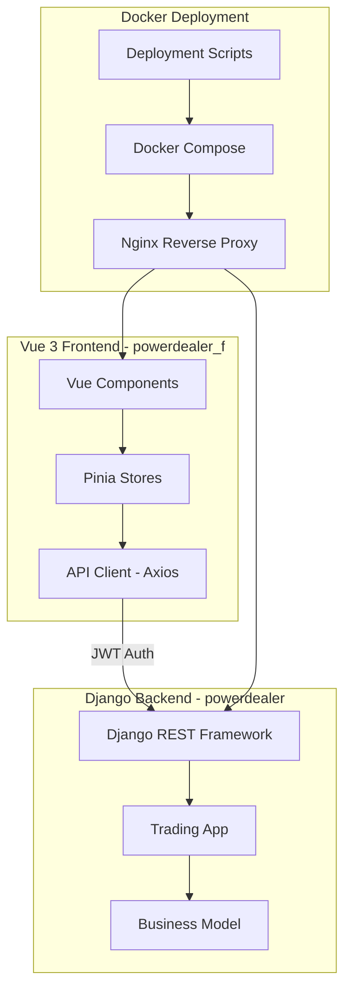

# PowerDealer Project File Analysis

## Project Overview

This is a **Multi-Tenant Business Management Platform** built with Django (backend) and Vue 3 (frontend), designed for Docker-based deployment.

---

## File and Folder Analysis Table

### Django Core Files

| File/Folder Name | Purpose |
|------------------|---------|
| [`powerdealer/manage.py`](powerdealer/manage.py) | Django's command-line utility for administrative tasks (running server, migrations, etc.) |
| [`powerdealer/src/__init__.py`](powerdealer/src/__init__.py) | Python package marker for the Django project |
| [`powerdealer/src/settings.py`](powerdealer/src/settings.py) | Django project configuration (database, middleware, installed apps, CORS, JWT settings) |
| [`powerdealer/src/urls.py`](powerdealer/src/urls.py) | Root URL routing configuration for the Django project |
| [`powerdealer/src/wsgi.py`](powerdealer/src/wsgi.py) | WSGI application entry point for production deployment |
| [`powerdealer/src/asgi.py`](powerdealer/src/asgi.py) | ASGI application entry point for async deployment |
| [`powerdealer/trading/__init__.py`](powerdealer/trading/__init__.py) | Python package marker for the trading app |
| [`powerdealer/trading/apps.py`](powerdealer/trading/apps.py) | Django app configuration for the trading module |
| [`powerdealer/trading/admin.py`](powerdealer/trading/admin.py) | Django admin panel configuration for Business model |
| [`powerdealer/trading/migrations/__init__.py`](powerdealer/trading/migrations/__init__.py) | Python package marker for migrations |
| [`powerdealer/trading/migrations/0001_initial.py`](powerdealer/trading/migrations/0001_initial.py) | Initial database migration for Business model |

### App Logic Files

| File/Folder Name | Purpose |
|------------------|---------|
| [`powerdealer/trading/models.py`](powerdealer/trading/models.py) | Defines the Business model with owner, name, email, phone, address fields |
| [`powerdealer/trading/views.py`](powerdealer/trading/views.py) | API views for authentication (signup, login) and business management |
| [`powerdealer/trading/serializers.py`](powerdealer/trading/serializers.py) | DRF serializers for User and Business model validation/serialization |
| [`powerdealer/trading/urls.py`](powerdealer/trading/urls.py) | URL routes for trading app API endpoints |
| [`powerdealer/trading/exceptions.py`](powerdealer/trading/exceptions.py) | Custom exception handlers for API error responses |
| [`powerdealer/trading/tests.py`](powerdealer/trading/tests.py) | Test file for trading app (minimal, placeholder) |
| [`powerdealer_f/src/main.js`](powerdealer_f/src/main.js) | Vue application entry point, initializes Vue app, Pinia, and router |
| [`powerdealer_f/src/App.vue`](powerdealer_f/src/App.vue) | Root Vue component with router-view |
| [`powerdealer_f/src/router.js`](powerdealer_f/src/router.js) | Vue Router configuration with routes for login, signup, dashboard |
| [`powerdealer_f/src/api/client.js`](powerdealer_f/src/api/client.js) | Axios instance with interceptors for JWT token handling |
| [`powerdealer_f/src/api/auth.js`](powerdealer_f/src/api/auth.js) | Authentication API methods (login, signup, token refresh) |
| [`powerdealer_f/src/stores/auth.js`](powerdealer_f/src/stores/auth.js) | Pinia store for authentication state management |
| [`powerdealer_f/src/stores/business.js`](powerdealer_f/src/stores/business.js) | Pinia store for business data management |
| [`powerdealer_f/src/views/LoginView.vue`](powerdealer_f/src/views/LoginView.vue) | Login page component |
| [`powerdealer_f/src/views/SignupView.vue`](powerdealer_f/src/views/SignupView.vue) | Signup/registration page component |
| [`powerdealer_f/src/views/DashboardView.vue`](powerdealer_f/src/views/DashboardView.vue) | Main dashboard for business management |

### Environment/Temporary Files

| File/Folder Name | Purpose | Safe to Ignore? |
|------------------|---------|-----------------|
| | [`vps_web_logs.log`](vps_web_logs.log) | VPS web server logs (visible in VSCode) | ⚠️ **LOG FILE** - Safe to ignore, should be in .gitignore |
| [`.env.example`](.env.example) | Template for environment variables | Keep for reference |
| [`.gitignore`](.gitignore) | Git ignore patterns for Python, Node, Docker | Essential |
| [`requirements.txt`](requirements.txt) | Python dependencies (Django, DRF, JWT, CORS) | Essential |
| [`docker-compose.yml`](docker-compose.yml) | Docker Compose for development environment | Essential |
| [`docker-compose.prod.yml`](docker-compose.prod.yml) | Docker Compose for production deployment | Essential |
| [`powerdealer/Dockerfile`](powerdealer/Dockerfile) | Docker image build for Django backend | Essential |
| [`powerdealer/requirements.txt`](powerdealer/requirements.txt) | Duplicate of root requirements.txt | Redundant but kept for Docker context |
| [`powerdealer_f/Dockerfile`](powerdealer_f/Dockerfile) | Docker image build for Vue frontend (production) | Essential |
| [`powerdealer_f/Dockerfile.dev`](powerdealer_f/Dockerfile.dev) | Docker image build for Vue frontend (development) | Development only |
| [`powerdealer_f/package.json`](powerdealer_f/package.json) | Node.js dependencies configuration | Essential |
| [`powerdealer_f/package-lock.json`](powerdealer_f/package-lock.json) | Locked Node.js dependency versions | Essential, auto-generated |
| [`powerdealer_f/vite.config.js`](powerdealer_f/vite.config.js) | Vite bundler configuration | Essential |
| [`powerdealer_f/index.html`](powerdealer_f/index.html) | HTML entry point for Vue app | Essential |
| [`powerdealer_f/nginx.conf`](powerdealer_f/nginx.conf) | Nginx config for serving frontend | Essential |
| [`nginx/nginx.conf`](nginx/nginx.conf) | Main nginx configuration | Essential |
| [`nginx/conf.d/default.conf`](nginx/conf.d/default.conf) | Default nginx site configuration | Essential |
| [`nginx/conf.d/default.conf.template`](nginx/conf.d/default.conf.template) | Template for SSL-enabled nginx config | Essential |
| [`scripts/backup.sh`](scripts/backup.sh) | Database and media backup script | Essential for production |
| [`scripts/deploy.sh`](scripts/deploy.sh) | Manual deployment script | Essential for production |
| [`scripts/init-ssl.sh`](scripts/init-ssl.sh) | Let's Encrypt SSL certificate setup | Essential for production |
| [`scripts/setup-vps.sh`](scripts/setup-vps.sh) | Initial VPS provisioning script | Essential for production |
| [`ssh_vps.py`](ssh_vps.py) | Python script for VPS health checks via SSH | Development utility |
| [`stb.bat`](stb.bat) | Windows batch script to start backend server | Development utility |
| [`stf.bat`](stf.bat) | Windows batch script to start frontend server | Development utility |
| [`README.md`](README.md) | Project documentation and setup guide | Essential |
| [`DEPLOY.md`](DEPLOY.md) | Deployment documentation | Essential |
| [`SETUP.md`](SETUP.md) | Setup instructions | Essential |
| [`BRS.txt`](BRS.txt) | Business Requirements Specification | Essential |
| [`guideline.txt`](guideline.txt) | Technical development guidelines | Essential |
| [`My_Note.txt`](My_Note.txt) | Personal development notes | Optional |

---

## Files Safe to Ignore/Delete

### ⚠️ Temporary Files (Recommended for Cleanup)

| File | Reason |
|------|--------|
| `a` | Git branch output, appears to be accidental commit |
| `telemetry-id` | Auto-generated UUID, not part of source code |
| `tempsshpass.tar.gz` | Temporary archive, should be deleted after use |
| `vps_web_logs.log` | Log file that should be in .gitignore |

### 🔒 Sensitive Files (Should NOT be in Repository)

| File | Reason |
|------|--------|
| `askpass.sh` | Contains hardcoded password - **SECURITY RISK** |
| `ssh_vps.py` | Contains hardcoded VPS password - **SECURITY RISK** |

---

## Recommended .gitignore Additions

```gitignore
# Temporary files
a
telemetry-id
tempsshpass.tar.gz

# Log files
*.log
vps_web_logs.log

# Sensitive scripts (if accidentally created)
askpass.sh
```

---

## Project Architecture Diagram



---

## Summary

| Category | Count |
|----------|-------|
| Django Core Files | 11 |
| App Logic Files | 16 |
| Environment/Config Files | 27 |
| **Total Files** | **54** |

### Files to Clean Up
- **4 temporary/log files** safe to delete
- **2 files with sensitive credentials** need immediate attention
