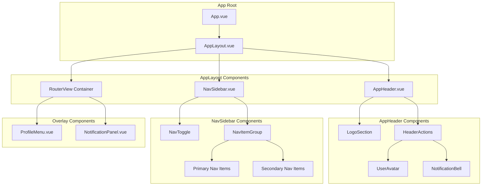
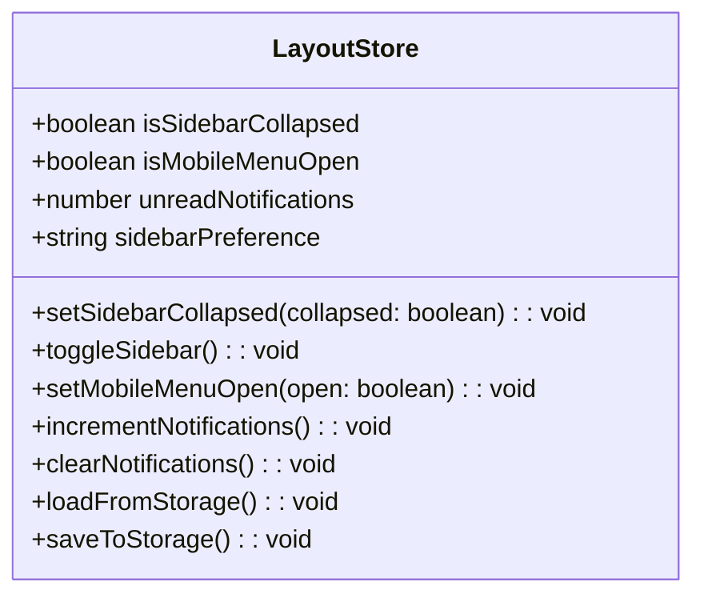
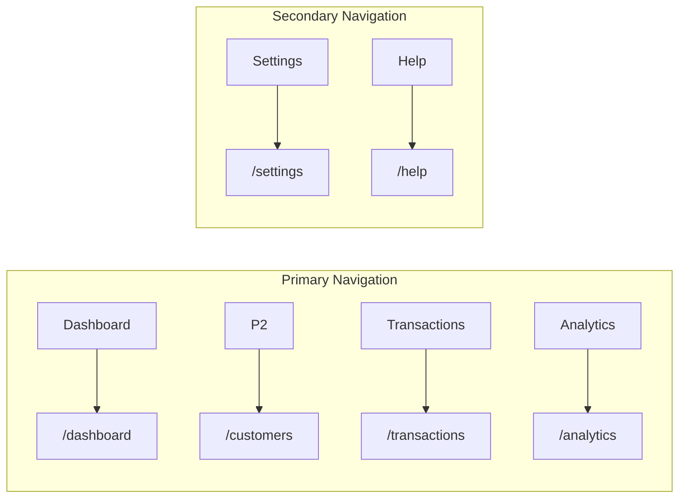

# Responsive Layout Shell - Architecture Specification

## 1. Executive Summary

This document outlines the architecture for implementing a responsive persistent layout shell for the PowerDealer application. The layout includes a global header top bar and a collapsible navigation rail sidebar that adapts seamlessly across mobile, tablet, and desktop viewports.

## 2. Component Architecture

### 2.1 Component Hierarchy



### 2.2 Core Components

| Component | File | Responsibility |
|-----------|------|----------------|
| `AppLayout` | `src/components/layout/AppLayout.vue` | Main shell, manages sidebar state, responsive breakpoints |
| `AppHeader` | `src/components/layout/AppHeader.vue` | Global top bar with logo, user avatar, notifications |
| `NavSidebar` | `src/components/layout/NavSidebar.vue` | Collapsible navigation rail |
| `NavItem` | `src/components/layout/NavItem.vue` | Individual navigation link item |
| `NavItemGroup` | `src/components/layout/NavItemGroup.vue` | Grouped navigation items with separators |
| `ProfileMenu` | `src/components/layout/ProfileMenu.vue` | User dropdown menu |
| `NotificationPanel` | `src/components/layout/NotificationPanel.vue` | Notifications dropdown panel |
| `UserAvatar` | `src/components/common/UserAvatar.vue` | Reusable avatar component |
| `NotificationBell` | `src/components/common/NotificationBell.vue` | Notification icon with badge |

## 3. State Management

### 3.1 Pinia Store Structure



### 3.2 State Properties

**File:** `src/stores/layout.js`

```javascript
export const useLayoutStore = defineStore('layout', {
  state: () => ({
    // Sidebar state
    isSidebarCollapsed: false,
    
    // Mobile menu state
    isMobileMenuOpen: false,
    
    // Notification state
    unreadNotifications: 0,
    notifications: [],
    
    // User profile (from auth store)
    user: null,
  }),
  
  actions: {
    toggleSidebar() {
      this.isSidebarCollapsed = !this.isSidebarCollapsed
      this.saveToStorage()
    },
    
    setSidebarCollapsed(collapsed) {
      this.isSidebarCollapsed = collapsed
      this.saveToStorage()
    },
    
    loadFromStorage() {
      const saved = localStorage.getItem('layout_preference')
      if (saved) {
        const prefs = JSON.parse(saved)
        this.isSidebarCollapsed = prefs.sidebarCollapsed ?? false
      }
    },
    
    saveToStorage() {
      localStorage.setItem('layout_preference', JSON.stringify({
        sidebarCollapsed: this.isSidebarCollapsed
      }))
    }
  }
})
```

### 3.3 LocalStorage Schema

```json
{
  "layout_preference": {
    "sidebarCollapsed": false,
    "lastUpdated": "2024-01-01T00:00:00Z"
  }
}
```

## 4. Responsive Breakpoints

### 4.1 Breakpoint Strategy

| Breakpoint | Width | Sidebar Behavior | Header Behavior |
|------------|-------|------------------|-----------------|
| Mobile | < 768px | Hidden, overlay mode | Compact, hamburger menu |
| Tablet | 768px - 1024px | Collapsed by default (64px) | Standard |
| Desktop | > 1024px | User preference (64px or 240px) | Standard |

### 4.2 CSS Custom Properties

```css
:root {
  /* Layout dimensions */
  --header-height: 64px;
  --sidebar-width-expanded: 240px;
  --sidebar-width-collapsed: 64px;
  
  /* Colors */
  --color-primary: #1976d2;
  --color-primary-dark: #1565c0;
  --color-surface: #ffffff;
  --color-background: #f5f5f5;
  --color-text-primary: #212121;
  --color-text-secondary: #757575;
  --color-border: #e0e0e0;
  --color-active-bg: #e3f2fd;
  --color-active-border: #1976d2;
  
  /* Transitions */
  --transition-duration: 200ms;
  --transition-timing: ease-in-out;
}
```

## 5. Navigation Structure

### 5.1 Navigation Groups



### 5.2 Route Structure

```javascript
// Proposed router structure
const routes = [
  {
    path: '/',
    component: AppLayout,  // Layout wrapper
    children: [
      {
        path: 'dashboard',
        name: 'Dashboard',
        component: DashboardView,
        meta: { 
          title: 'Dashboard',
          icon: 'dashboard',
          group: 'primary'
        }
      },
      {
        path: 'transactions',
        name: 'Transactions',
        meta: { 
          title: 'Transactions',
          icon: 'receipt_long',
          group: 'primary'
        },
        children: [
          {
            path: 'customers',
            name: 'Customers',
            component: CustomersView,
            meta: { 
              title: 'Customers',
              icon: 'people',
              group: 'primary'
            }
          }
        ]
      },
      {
        path: 'analytics',
        name: 'Analytics',
        component: AnalyticsView,
        meta: { 
          title: 'Analytics',
          icon: 'analytics',
          group: 'primary'
        }
      },
      {
        path: 'settings',
        name: 'Settings',
        component: SettingsView,
        meta: { 
          title: 'Settings',
          icon: 'settings',
          group: 'secondary'
        }
      },
      {
        path: 'help',
        name: 'Help',
        component: HelpView,
        meta: { 
          title: 'Help',
          icon: 'help',
          group: 'secondary'
        }
      }
    ]
  }
]
```

## 6. Accessibility Requirements

### 6.1 Keyboard Navigation

| Requirement | Implementation |
|-------------|----------------|
| Focus indicators | `:focus-visible` styles with 2px outline |
| Tab order | Header → Sidebar → Main content |
| Skip links | "Skip to main content" link |
| Arrow keys | Navigate between nav items |
| Escape key | Close dropdown menus, notification panel |

### 6.2 ARIA Attributes

```html
<!-- Header -->
<header role="banner" aria-label="Application header">
  <button aria-label="Toggle navigation" aria-expanded="...">
  <button aria-label="Notifications" aria-haspopup="true" aria-expanded="...">
  <button aria-label="User menu" aria-haspopup="true" aria-expanded="...">
</header>

<!-- Sidebar -->
<nav role="navigation" aria-label="Main navigation">
  <ul role="menubar">
    <li role="none">
      <a role="menuitem" aria-current="page" href="...">
    </li>
  </ul>
</nav>
```

### 6.3 Color Contrast

| Element | Normal | Hover | Active |
|---------|--------|-------|--------|
| Nav item text | 4.5:1 (AA) | 4.5:1 | 4.5:1 |
| Nav item background | N/A | 3:1 | 3:1 |
| Active indicator | 3:1 | N/A | N/A |

## 7. Component Specifications

### 7.1 AppLayout.vue

```vue
<template>
  <div 
    class="app-layout"
    :class="{ 'sidebar-collapsed': layoutStore.isSidebarCollapsed }"
  >
    <AppHeader />
    
    <NavSidebar />
    
    <main class="main-content" role="main">
      <router-view v-slot="{ Component }">
        <transition name="fade" mode="out-in">
          <component :is="Component" />
        </transition>
      </router-view>
    </main>
    
    <!-- Mobile overlay -->
    <div 
      v-if="layoutStore.isMobileMenuOpen"
      class="mobile-overlay"
      @click="layoutStore.setMobileMenuOpen(false)"
    />
  </div>
</template>
```

### 7.2 AppHeader.vue

```vue
<template>
  <header class="app-header">
    <!-- Left: Logo and Company Name -->
    <div class="header-left">
      <router-link to="/" class="logo-link">
        
        <span class="company-name">PowerDealer</span>
      </router-link>
    </div>
    
    <!-- Right: User Avatar and Notifications -->
    <div class="header-right">
      <NotificationBell 
        :unread-count="layoutStore.unreadNotifications"
        @click="toggleNotificationPanel"
      />
      
      <UserAvatar 
        :src="authStore.user?.avatar"
        :name="authStore.user?.name"
        @click="toggleProfileMenu"
      />
    </div>
    
    <!-- Dropdowns -->
    <ProfileMenu 
      v-if="showProfileMenu"
      :user="authStore.user"
      @close="showProfileMenu = false"
    />
    
    <NotificationPanel 
      v-if="showNotifications"
      :notifications="layoutStore.notifications"
      @close="showNotifications = false"
    />
  </header>
</template>
```

### 7.3 NavSidebar.vue

```vue
<template>
  <aside 
    class="nav-sidebar"
    :class="{ 'collapsed': layoutStore.isSidebarCollapsed }"
    role="navigation"
    aria-label="Main navigation"
  >
    <!-- Toggle Button -->
    <button 
      class="sidebar-toggle"
      @click="layoutStore.toggleSidebar"
      :aria-label="layoutStore.isSidebarCollapsed ? 'Expand sidebar' : 'Collapse sidebar'"
    >
      <span class="toggle-icon">{{ layoutStore.isSidebarCollapsed ? '→' : '←' }}</span>
    </button>
    
    <!-- Primary Navigation Group -->
    <nav-item-group title="Primary" :collapsed="layoutStore.isSidebarCollapsed">
      <NavItem 
        v-for="item in primaryNavItems"
        :key="item.path"
        :item="item"
        :collapsed="layoutStore.isSidebarCollapsed"
      />
    </nav-item-group>
    
    <!-- Secondary Navigation Group -->
    <nav-item-group title="Resources" :collapsed="layoutStore.isSidebarCollapsed">
      <NavItem 
        v-for="item in secondaryNavItems"
        :key="item.path"
        :item="item"
        :collapsed="layoutStore.isSidebarCollapsed"
      />
    </nav-item-group>
  </aside>
</template>
```

## 8. File Structure

```
powerdealer_f/src/
├── components/
│   ├── layout/
│   │   ├── AppLayout.vue
│   │   ├── AppHeader.vue
│   │   ├── NavSidebar.vue
│   │   ├── NavItem.vue
│   │   ├── NavItemGroup.vue
│   │   ├── ProfileMenu.vue
│   │   └── NotificationPanel.vue
│   └── common/
│       ├── UserAvatar.vue
│       └── NotificationBell.vue
├── stores/
│   ├── layout.js        # NEW - Sidebar and notification state
│   └── auth.js          # EXISTING - User authentication state
├── views/
│   ├── DashboardView.vue    # EXISTING
│   ├── CustomersView.vue    # EXISTING
│   ├── AnalyticsView.vue    # NEW
│   ├── SettingsView.vue     # NEW
│   └── HelpView.vue         # NEW
├── router.js             # MODIFY - Add nested routes
└── App.vue               # MODIFY - Use AppLayout
```

## 9. Implementation Priority

| Priority | Component | Description |
|----------|-----------|-------------|
| P0 | AppLayout | Main shell container |
| P0 | NavSidebar | Collapsible navigation |
| P0 | AppHeader | Header with logo and actions |
| P1 | NavItem/NavItemGroup | Navigation items |
| P1 | LayoutStore | State persistence |
| P2 | ProfileMenu | User dropdown |
| P2 | NotificationPanel | Notifications dropdown |
| P2 | AnalyticsView | New view page |
| P3 | SettingsView | New view page |
| P3 | HelpView | New view page |

## 10. Summary

This architecture provides:

1. **Responsive Design** - Adapts to mobile, tablet, and desktop
2. **State Persistence** - Sidebar preference saved to localStorage
3. **Accessibility** - Keyboard navigation, ARIA labels, color contrast
4. **Component Reusability** - Modular, composable components
5. **Maintainability** - Clear separation of concerns with Pinia stores
